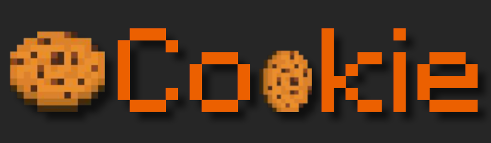

[](LICENSE)
[](https://ci.nukkitx.com/job/NukkitX/job/Server/job/master/)

[](https://discord.gg/5PzMkyK)

Introduction
-------------

Cookie is a server software for Minecraft: Bedrock Edition depend on Cloudburst.

We are committed to bringing better architecture and original features to nk2.

This project are still under developing, we welcome new developers join us.

Build JAR file
-------------
- `git clone https://github.com/Cookie-Studio/Cookie.git`
- `cd Cookie`
- `git submodule update --init`
- `./mvnw clean package`

The compiled JAR can be found in the `target/` directory.

Running
-------------
Simply run `java -jar Cookie.jar`.

Plugin API
-------------
Information on Cloudburst's API can be found at the [wiki](https://cloudburstmc.org/wiki/cloudburst/).

Docker
-------------

Running Nukkit in [Docker](https://www.docker.com/) (17.05+ or higher).

Build image from source,

```
docker build -t nukkit .
```

Run once to generate the `/data` volume, default settings, and choose language,

```
docker run -it --rm -p 19132:19132 nukkit
```

Use [docker-compose](https://docs.docker.com/compose/overview/) to start server on port `19132` and with `./data` volume,

```
docker-compose up -d
```

Contributing
------------
Please read the [CONTRIBUTING](.github/CONTRIBUTING.md) guide before submitting any issue. Issues with insufficient information or in the wrong format will be closed and will not be reviewed.
